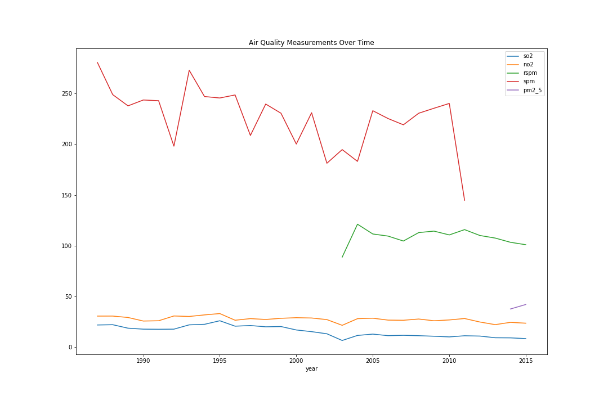
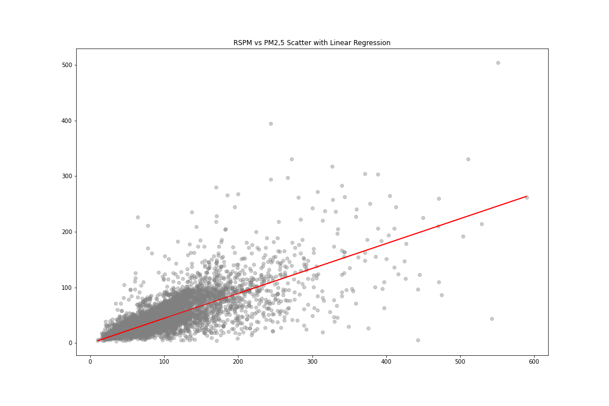

# Air Quality and Life Expectancy Analysis in India

#### Galvanize DSI Capstone 1

#### Hanzhi Guo
------
## Motivation

The concern over air pollution's effects on health is a widely debated topic. The WHO estimates [7 million premature deaths annually due to air pollution](http://www.who.int/mediacentre/news/releases/2014/air-pollution/en/). That is quite concerning so let's dive in!

------
## What we are looking for?

1. Is there any correlation between air pollution and life expectancy?
2. What specific factors may correlate with life expectancy?
3. How has India's air quality changed over the years of 1987 and 2015?
------

## Data

* SO2: [Sulfur Dioxide](https://www.cdc.gov/niosh/topics/sulfurdioxide/default.html)
  * Exposure may cause nasal mucus, choking, cough, and reflex bronchi constriction
* NO2: [Nitrogen Dioxide](https://www.epa.gov/no2-pollution/basic-information-about-no2)
  * Exposure may cause asthma and potentially increase susceptibility to respiratory infections
* PM2_5: [Particulate Matter less than 2.5 micron](https://drsiew.com/beating-the-haze-understanding-psi-pm-2-5/)
  * This is the most important indicator of air pollution that affects health
* RSPM: Respirable Suspended Particulate Matter
* SPM: Suspended Particulate Matter
* Actual_Span: Actual Life Span the avg citizen in a state

------

## Methods Used
* Bootstrap
* Correlations
* Linear Regression
* Prediction

## Tools
* Numpy
* Pandas
* Matplotlib
* Geopandas
* Sklearn
------

## General Findings

## Hypotheses Results

H_0: There is a correlation between Sulfur Dioxide and Life Expectancy

H_a: There is not a correlation between Sulfur Dioxide and Life Expectancy

0 lies within 95% confidence interval thus we __reject__ the __null__ hypothesis.

------
H_0: There is a correlation between Nitrogen Dioxide and Life Expectancy

H_a: There is not a correlation between Nitrogen Dioxide and Life Expectancy

0 lies within 95% confidence interval thus we __reject__ the __null__ hypothesis.

------

## Conclusion

Within this data set, there is not enough evidence to prove that air pollution correlates with life expectancy.

## Data Sources
[India Air Quality](https://www.kaggle.com/shrutibhargava94/india-air-quality-data)

[India Life Expectancy](https://www.kaggle.com/nimishukey/life-expectancy-in-india)

[India Map](https://github.com/datta07/INDIAN-SHAPEFILES)

