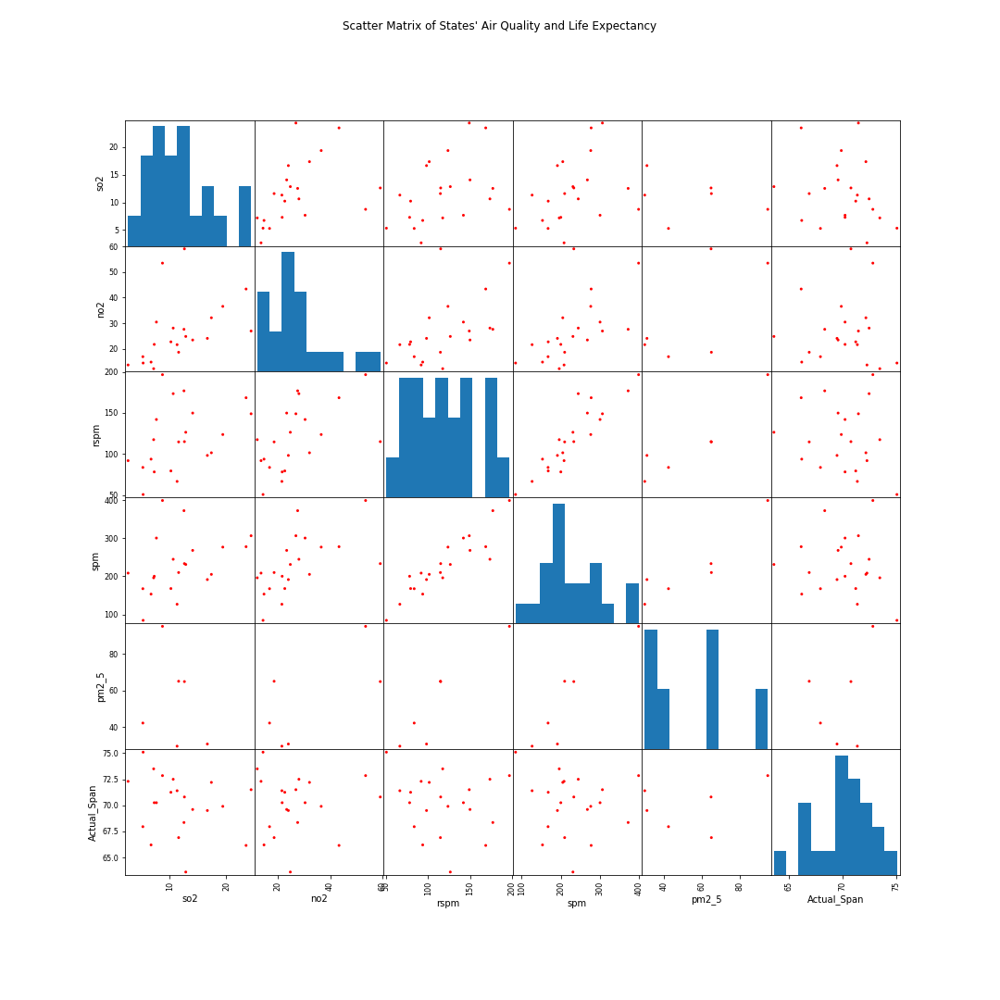

# Air Quality and Life Span Analysis in India

#### Galvanize DSI Capstone 1

#### Hanzhi Guo
------

  

## Motivation

The concern over air pollution's effects on health is a widely debated topic. The WHO estimates [7 million premature deaths annually due to air pollution](http://www.who.int/mediacentre/news/releases/2014/air-pollution/en/). The most common metrics measured are SPM, RSPM, PM2.5, SO2, and NO2. Health issues tend to arise when these metrics become high. Let's see if air pollution has any effect on life span. Should there be drastic/urgent measures taken to lower pollution?

------
## What we are looking for?

1. What specific factors may correlate with life span?
2. Is there any correlation between air pollution and life span?
3. Is there statistically significant correlations between air pollution and life span?
4. How has India's air quality changed over the years of 1987 and 2015?
------

## Data

* SO2: [Sulfur Dioxide](https://www.cdc.gov/niosh/topics/sulfurdioxide/default.html)
  * Exposure may cause nasal mucus, choking, cough, and reflex bronchi constriction
* NO2: [Nitrogen Dioxide](https://www.epa.gov/no2-pollution/basic-information-about-no2)
  * Exposure may cause asthma and potentially increase susceptibility to respiratory infections
* PM2.5: [Particulate Matter less than 2.5 micron](https://drsiew.com/beating-the-haze-understanding-psi-pm-2-5/)
  * This is the most important indicator of air pollution that affects health
* RSPM: Respirable Suspended Particulate Matter (up to 100 micron)
  * RSPM and PM2.5 can be inferred from SPM
* SPM: Suspended Particulate Matter (greater than 100 micron)
  * [More information on Suspended Particulates](http://www.dust-monitoring-equipment.com/suspended-particulate-matter-definition.pdf)
* Actual_Span: Actual Life Span of the avg citizen in India by state

------

## Methods Used
* Bootstrap
* Correlations
* Linear Regression
* Prediction

## Tools
* Numpy
* Pandas
* Matplotlib
* Geopandas
* Sklearn
------

## General Findings

Let's start with some GeoPandas heatmap map of SO2, NO2, and Life Span in each state in India. 

It is not clear whether there is any patterns/correlations just by looking at the map. The SO2 and NO2 map seem to not align visually with the Life Span map. Below is all of the states of India sorted by SPM measurement. 

Looking at the data we see that RSPM and PM2.5 are not quite full. RSPM is 100 microns and PM2.5 is 2.5 microns. It seems that the tools for measuring smaller particulates were not available until recently. Widespread measurement of RSPM started around 2003 and PM2.5 started by 2014; both of those metrics are better guages for health.

Now we can see clearly that there is a correlation between NO2 and SO2 along with some other light correlations between the pollution measurements.

By using linear regression, I was able to calculate the scaling factor between SPM, RSPM, and PM2.5

Let's see if we can predict the RSPM and PM2.5 using the nice full SPM data. From the reasearch I did about By using the linear scaling factors, RSPM and PM2.5 be calculated if the ratios to SPM are known. Utilizing Linear Regression, fit and trained the model with SPM, RSPM, and PM2.5 data, then I predicted the history data for RSPM and PM2.5 using the model.

## Statistical Analysis of Correlations

Looking at the correlations between Life Span and the different air pollution factors, it's clear that SO2 has the strongest correlation and NO2 has the weakest correlation. As a data scientist, we cannot rely on a correlation number to make statistical claims. Correlations have central tendency. We need to bootstrap the data and find the 95% confidence interval for the correlations. 

H0: There is not a correlation between Sulfur Dioxide and Life Span

Ha: There is a correlation between Sulfur Dioxide and Life Span

After bootstrapping 3000 samples and finding the correlations, we get this pearson r distribution. Even though there is a 87% chance that r < 0, 
r = 0 correlation lies within the 95% confidence interval thus we __fail to reject__ the __null__ hypothesis.

------
H0: There is not a correlation between Nitrogen Dioxide and Life Span

Ha: There is a correlation between Nitrogen Dioxide and Life Span

r = 0 correlation lies within the 95% confidence interval thus we __fail to reject__ the __null__ hypothesis.

------

## Conclusion

Within this data set, we cannot say with confidence that air pollution has any correlation with actual life span in India. 

------
## Further Investigations

There are so many factors that may be attributing to the Omitted Variable Bias. It is difficult to pinpoint the specific variables that may be affecting life span when the life span is given by state, thus it would be beneficial to look into more granular health data such as lung diseases, asthma, and life span by cities. 

------

## Data Sources
[India Air Quality](https://www.kaggle.com/shrutibhargava94/india-air-quality-data)

[India Life Expectancy](https://www.kaggle.com/nimishukey/life-expectancy-in-india)

[India Map](https://github.com/datta07/INDIAN-SHAPEFILES)

