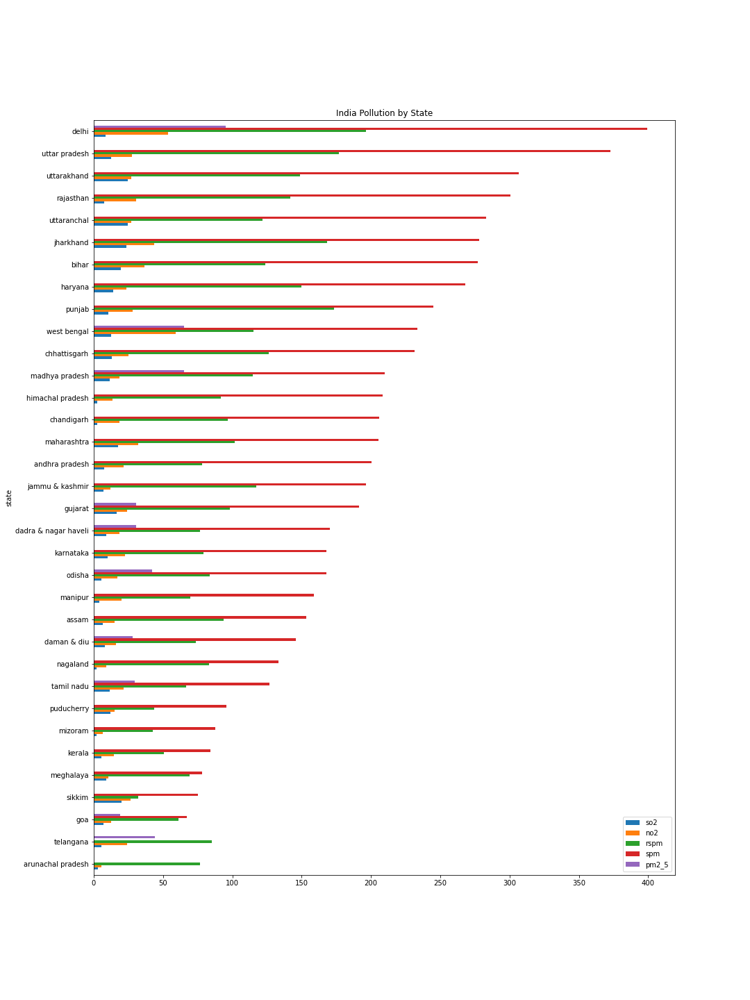
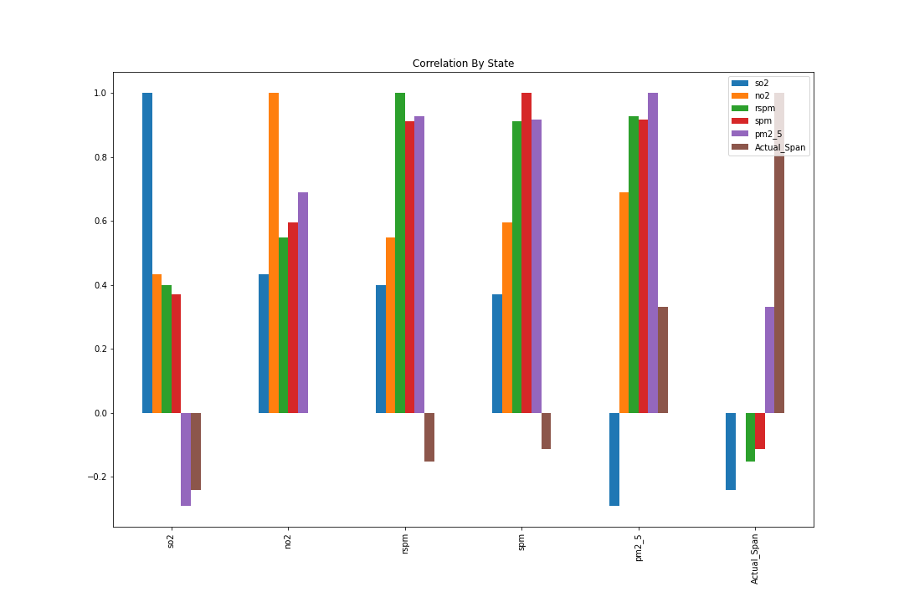
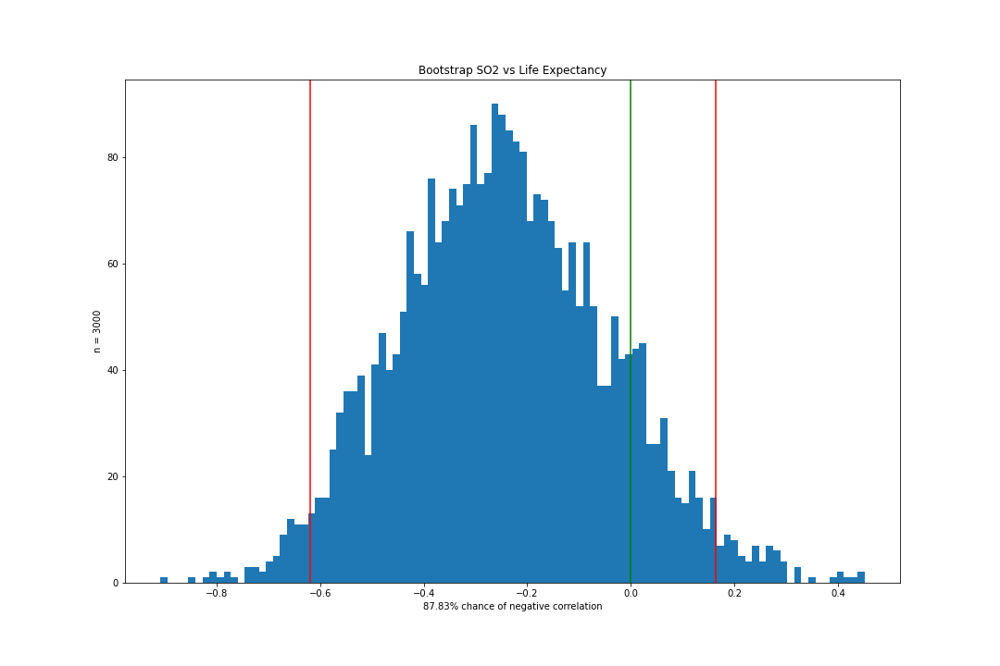

# Air Quality and Life Span Analysis in India

#### Galvanize DSI Capstone 1

#### Hanzhi Guo
------
## Motivation

The concern over air pollution's effects on health is a widely debated topic. The WHO estimates [7 million premature deaths annually due to air pollution](http://www.who.int/mediacentre/news/releases/2014/air-pollution/en/). That is quite concerning so let's dive in!

------
## What we are looking for?

1. Is there any correlation between air pollution and life span?
2. What specific factors may correlate with life span?
3. How has India's air quality changed over the years of 1987 and 2015?
------

## Data

* SO2: [Sulfur Dioxide](https://www.cdc.gov/niosh/topics/sulfurdioxide/default.html)
  * Exposure may cause nasal mucus, choking, cough, and reflex bronchi constriction
* NO2: [Nitrogen Dioxide](https://www.epa.gov/no2-pollution/basic-information-about-no2)
  * Exposure may cause asthma and potentially increase susceptibility to respiratory infections
* PM2.5: [Particulate Matter less than 2.5 micron](https://drsiew.com/beating-the-haze-understanding-psi-pm-2-5/)
  * This is the most important indicator of air pollution that affects health
* RSPM: Respirable Suspended Particulate Matter (up to 100 micron)
  * RSPM and PM2.5 can be inferred from SPM
* SPM: Suspended Particulate Matter (greater than 100 micron)
  * [More information on Suspended Particulates](http://www.dust-monitoring-equipment.com/suspended-particulate-matter-definition.pdf)
* Actual_Span: Actual Life Span of the avg citizen in India by state

------

## Methods Used
* Bootstrap
* Correlations
* Linear Regression
* Prediction

## Tools
* Numpy
* Pandas
* Matplotlib
* Geopandas
* Sklearn
------

## General Findings

It seems that the tools for measuring smaller particulates were not available until recently. Let's see if we can predict the RSPM and PM2.5 values based on the SPM history.

By using linear regression, I was able to calculate the scaling factor between SPM, RSPM, and PM2.5

By using the linear scaling factors, I filled in the history of RSPM and PM2.5

## Hypotheses Results

H0: There is not a correlation between Sulfur Dioxide and Life Span

Ha: There is a correlation between Sulfur Dioxide and Life Span

Even though there is a 87% chance that r < 0, 
r = 0 correlation lies within the 95% confidence interval thus we __fail to reject__ the __null__ hypothesis.

------
H0: There is not a correlation between Nitrogen Dioxide and Life Span

Ha: There is a correlation between Nitrogen Dioxide and Life Span

r = 0 correlation lies within the 95% confidence interval thus we __fail to reject__ the __null__ hypothesis.

------

## Conclusion

Within this data set, there is not enough evidence to prove that air pollution correlates with life span.

------
## Further Investigations

It is difficult to pinpoint the specific variables that may be affecting life span when the life span is given by state, thus it would be beneficial to look into more granular health data such as lung diseases, asthma, and life span by cities. 

------

## Data Sources
[India Air Quality](https://www.kaggle.com/shrutibhargava94/india-air-quality-data)

[India Life Expectancy](https://www.kaggle.com/nimishukey/life-expectancy-in-india)

[India Map](https://github.com/datta07/INDIAN-SHAPEFILES)

